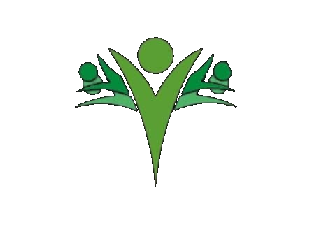

  

# Las Palmeras
App Flutter de una junta de vecinos, para crear eventos y reuniones: iniciar sesión, crear/editar/eliminar, marcarlas como completadas y filtrarlas (todas, pendientes, completas). Incluye cierre de sesión y validaciones básicas.

## Como Ejecutar
flutter pub get
flutter run

## Integrantes 
Mayra Melgarejo
Denisse Quimen

